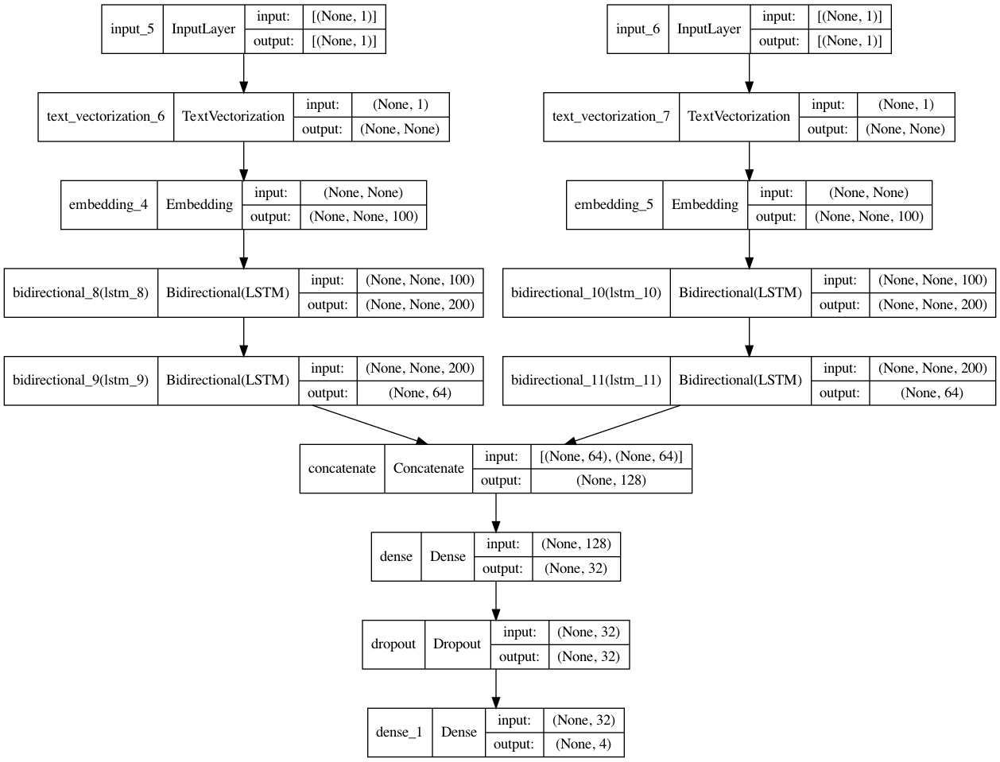

This jupyter notebook utilizes a recurrent neural network approach to categorize a multi-class dataset of news articles. The article titles are included as a feature by creating a second branch of the model which is fed the article title, calculating parameters separately from the main text of the article. This concatenation method is also useful for datasets that contain numerical and categorical features alongside text features.

